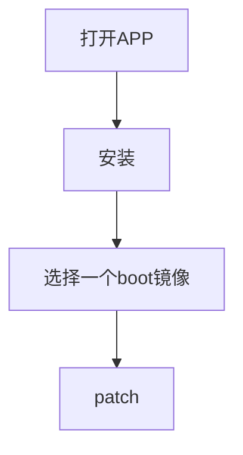
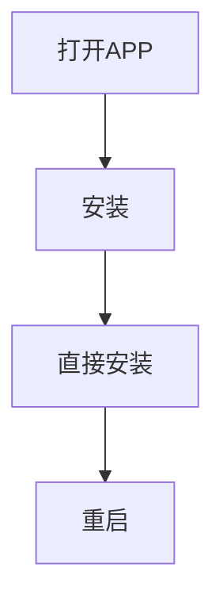

KernelSU官网：[KernelSU][1]

> ##### 环境
> 使用机型：Pixel6
> 
> 工程代号：oriole
>
> 刷前环境：Android14
>
> 目的：升级Andriod16并刷入KernelSU
{: .block-tip }

#### 到Android官网查找工厂镜像
Android工厂镜像列表：[列表][2]

#### 下载后并使用如下命令刷写
```shell
sh flash-all.sh
```

#### 安装KernelSU APP
从KernelSU官方release页面下载[Release][3],并进行安装。并将之前根据工程代号获取到的镜像解包出boot.img。之后将boot.img push到/sdcard


> ##### 注意
> 这里官方提到的如果已有root权限可直接安装并不包括已经使用Magisk Patched boot.img刷入的获取到的root权限。否则会报错刷入失败
{: .block-warning }

> pixel6的数据包是支持fastboot boot直接使用patch好的镜像启动，可以不刷入的
> ```shell
fastboot boot kernelsu-boot.img
> ```
> > 如果刷入patch好的boot.img在kernel3.0 apk在启动之后会闪退的 起不到Root Manager的作用的，所以这里推荐直接boot后再直接安装的方式进行持久化
> {: .block-warning }
{: .block-tips }

启动后再进行如下操作就可以愉快的使用了


[1]: https://kernelsu.org
[2]: https://developer.android.com/about/versions/16/download?hl=zh-cn
[3]: https://github.com/tiann/KernelSU/releases